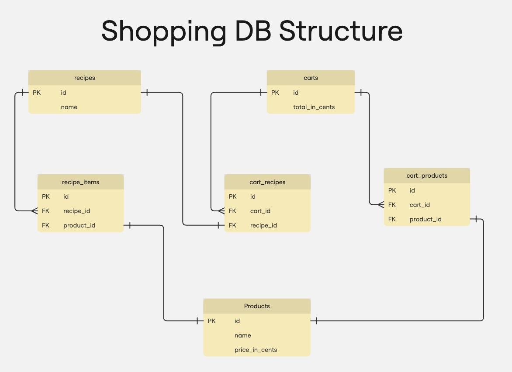

## About Project
Simple shopping backend project with features Product, Cart and Recipe

## Implementation details
* The service is implemented using Spring Boot and Kotlin.
* The database is PostgreSQL. In local development it uses docker container.
* The code is organised into packages by layer, according to the Hexagonal architecture principles.

## Local development

### Configuration
Before running the service, make sure that database is set up in the `application.yaml` file.

#### Database
To run the postgres container locally, use the docker-compose file in the root of the repository: `docker-compose up -d`.

### Running the service
To run the service, execute `./gradlew :bootrun`. Make certain that the database is running.

### Testing with Postman
To test the endpoints, you can use the Postman.
You can find example postman collection in the `postman` folder.

